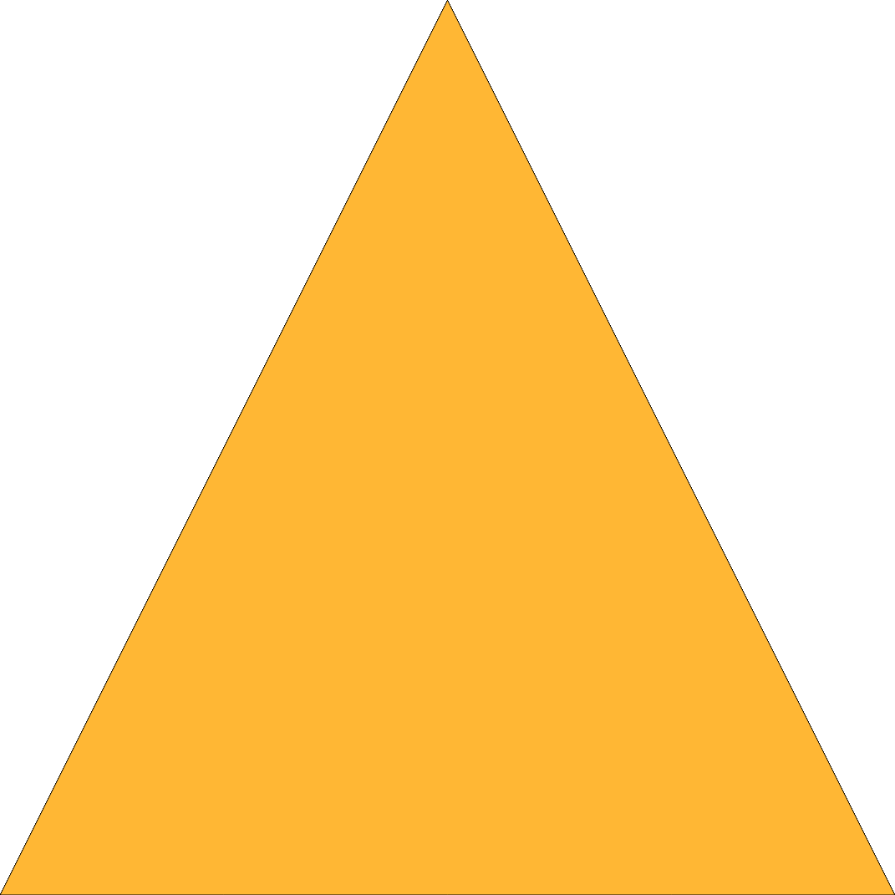

# Fun Fractals

Experimenting with recursion and graphics with the help of fractals.

## Sierpiński triangle
- [Wikipedia](https://en.wikipedia.org/wiki/Sierpi%C5%84ski_triangle)

### Construction

1. Start with an equilateral triangle (a triangle in which all three sides have the same length)
2. Subdivide it into four smaller triangles (using the middle points of the sides)
3. Remove the central triangle
4. For each remaining triangle recursively repeat from step 2

